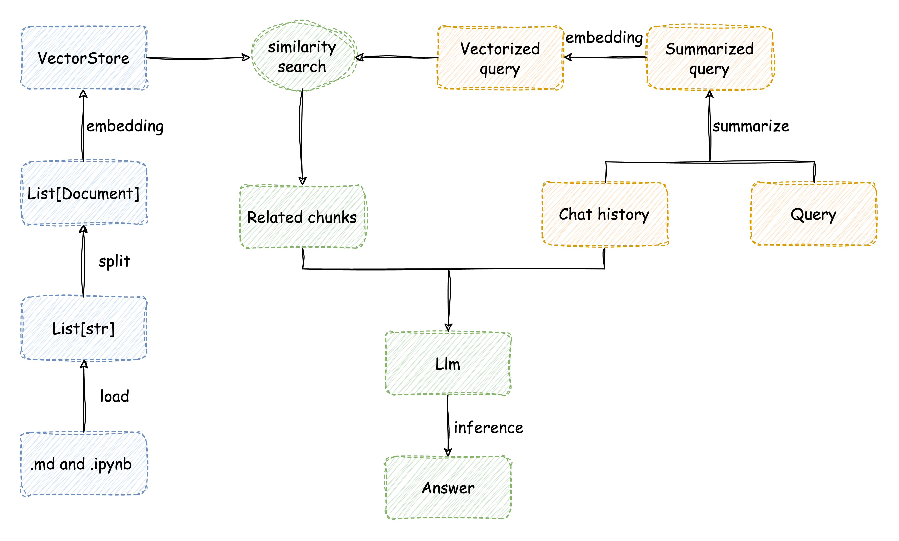

# 技术细节

## 实现流程
本项目技术细节如下图所示，除加载`markdown`及`notebook`文件外均使用`Langchain`实现。

<div style="text-align: center;">

</div>

## 代码结构
```
chat-with-llm-universe/
│
├── create_db/（存放加载文档并构建向量数据库的代码）
│   ├── create_db.py（加载文档并构建向量数据库）
│   └── load_data.py（存放加载文档的函数）
│
├── knowledge_db/（存放llm-universe第一部分及向量数据库）
│   ├── notebook/（存放llm-universe第一部分）
│   │   └── ...
│   └── vector_db/（存放向量数据库）
│       └── ... 
│
├── llm/（存放llm相关内容）
│   ├── llm.py（接入langchain的方法）
│   └── qwen.py（继承langchain的LLM示例）
│
├── qa_chain/（存放检索问答链）
│   └── qa_chain.py（检索问答链）
│
├── .env.template（环境变量模版文件）
│
├── app.py（使用Streamlit部署应用）
│
├── requirements_local.txt
│
├── requirements.txt
```